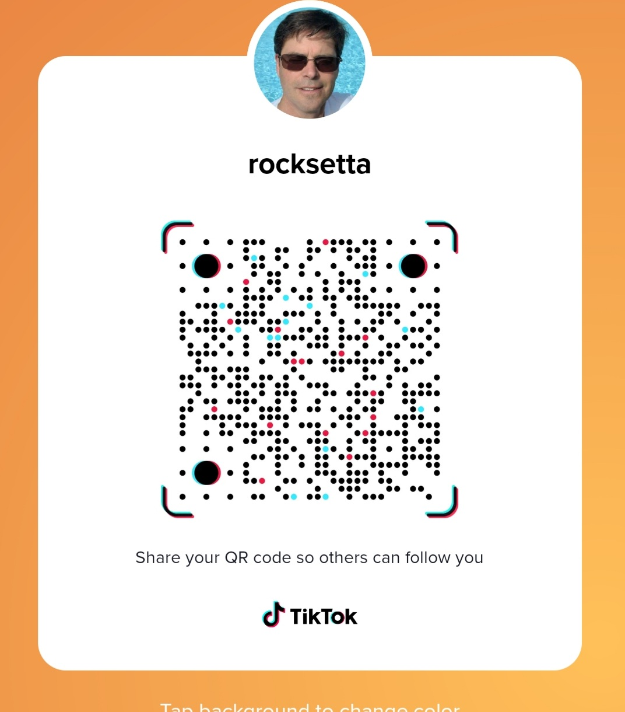

### Jeremy Ellis, Rocksetta

#### I simplify Robotics and Machine Learning

## [Maker100](https://github.com/hpssjellis/maker100)
Presenlty working on improving my 7 year student tested Arduino Clone Robotics course [old course here](https://github.com/hpssjellis/particle.io-photon-high-school-robotics) to a new robotics and Machine Learning course called [maker100](https://github.com/hpssjellis/maker100) designed for any non-engineering University program and is planned to be ready for Jan 2022.

The course introduces all the hands on basics of robotics; sensors and actuators, with a simplified [Edge Impulse](https://www.edgeimpulse.com/) Machine Learning introduction all based around the (in my opinion) best all round microcontroller the new Arduino Pro boards: ~$100 USD [PortentaH7](https://store.arduino.cc/usa/portenta-h7) the easy to program dual core 160 pin cybertruck of an Arduino, ~$50 USD Portenta Vision shields ([Ethernet](https://store.arduino.cc/usa/portenta-vision-shield) and [LoRaWan](https://store.arduino.cc/usa/portenta-vision-shield-lora)), ~$50 USD [Portenta Breakout Board](https://store.arduino.cc/usa/portenta-breakout). The course uses my ever changing offical Arduino IDE Library of examples [portenta-pro-community-solutions](https://github.com/hpssjellis/portenta-pro-community-solutions)

### Showing the Dual Core, 160 Pin, PortentaH7 on a breadboard upside down so the snap on Ethernet Vision Shield, Camera and Microphones are facing up, but still with easy access to the SD card and control button, visible is the Wifi and BLE antenae.
Needs extra male and female headers to do this.

## [Maker101](https://github.com/hpssjellis/maker101)

In researching the above Robotics Machine Learning Maker 100 program, I designed a simplified way to use TensorflowJS and TensorflowLite/micro with the Arduino boards. It is too complex for my High School students but would work well for a web based Javascript and Arduino C++ introduction to GoogleAI

**I would be willing to work over the duration of a few years with a University Professor on a paid [Google](https://blog.tensorflow.org/2021/06/2021-request-for-proposals-ml-faculty-awards.html?m=1) or other program to develop a TensorflowJS and TensorFlowMicro course as a University introduction to TinyML, Tensorflow and Machine Learning.** Using my working code, adapted with the Professors ideas and theory. Potentially my hands on videos, with the Professors theory videos. 

My TensorflowJS site is [www.rocksetta.com/tensorflowjs](https://www.rocksetta.com/tensorflowjs/) Note: everything is Vanilla Javascript as easy as possible. Examples are clear, Keras based and simple for students to build from.

My best, easiest TensorflowJS Vanilla Javascript example is this [xOr example](https://www.rocksetta.com/tensorflowjs/beginner-keras/20keras-xOr.html)

My TinyML Portenta examples site is [here](https://github.com/hpssjellis/my-examples-for-the-arduino-portentaH7/tree/master/m09-Tensoflow) although an easier example is on the above library.

## About Me

Name: Jeremy Ellis

Pronouns: he/him

Education: B.Sc. Chemistry 1986, B.Ed Swecondary School and a Diploma Counselling.  

Teaching: Have taught High School Math, General Science and Physics 11/12  

Now Teaching Coding (Game Development), Animation, Robotics and 3D Printing. All self developed courses.

Passionate about Open Source and the general public having hands on experience with both Robotics and Machine Learning.

I also teach a STEM class after school Thursdays at [GearBots.org](https://www.gearbots.org/)

Looking into how I can support capable Indigenous students to have access to Machine Learning

## Social Media

Website:  https://rocksetta.com/

Twitter:  https://twitter.com/rocksetta?lang=en

Github: This page!  https://github.com/hpssjellis

Instagram: 
 

TikTok (new) 
 

## Favorite Repositories

## Favorite Videos/Playlists

#### My Youtube list of Playlists

https://www.youtube.com/c/Rocksetta/playlists

#### Edge Impulse

https://www.youtube.com/playlist?list=PL57Dnr1H_egsQPnEObWHPhK1Q4g_IDWcR

#### Arduino Portenta H7 playlist by Rocksetta

https://www.youtube.com/playlist?list=PL57Dnr1H_egtm0pi-okmG0iE_X5dROaLw

#### Helium HNT The Peoples Network

https://www.youtube.com/playlist?list=PL57Dnr1H_egu0PkIBAbbdfQ21O_NJqJg8

####  Arduino High School Robotics

https://www.youtube.com/playlist?list=PL57Dnr1H_egv1FVzAcCZVeANJMs3Hta05

####  Particle High School Robotics
https://www.youtube.com/playlist?list=PL57Dnr1H_egsL0r4RXPA4PY2yZhOJk5Nr

#### My TensorflowJS Videos
https://www.youtube.com/watch?v=dnDb-RAvxHg&list=PL57Dnr1H_egukaDgFqwEnDVStd7Jktg1E

#### Social Distancing
https://www.youtube.com/watch?v=jquWGWDEVb4&list=PL57Dnr1H_egsp6jEaTTZwMgJgBoqrJzsq

#### Key Free Music
https://www.youtube.com/watch?v=qbmX1FDpbEM&list=PL57Dnr1H_egttPxXEgCf7Fn-Vh5OFHh1z

#### PhoneGap Javascript (OLD)
https://www.youtube.com/watch?v=aq4JByHZt9E&list=PL57Dnr1H_egu-ZY4_NyBaK8CY3sE5rCKK

## Other 

I get migraines but am wading through the Snake Oil and will eventually be able to reduce it from about 1 every 3 weeks, to a much lower number.

My arms both dislocate, but I find the less I play rugby or Kayack the less it is a problem.

###### By Jeremy Ellis. Use at your own risk!

<!--
**hpssjellis/hpssjellis** is a ✨ _special_ ✨ repository because its `README.md` (this file) appears on your GitHub profile.

Here are some ideas to get you started:

- 🔭 I’m currently working on ...  Hi there 👋
- 🌱 I’m currently learning ...
- 👯 I’m looking to collaborate on ...
- 🤔 I’m looking for help with ...
- 💬 Ask me about ...
- 📫 How to reach me: ...
- 😄 Pronouns: ...
- ⚡ Fun fact: ...
-->
  
  
  
  </body>
