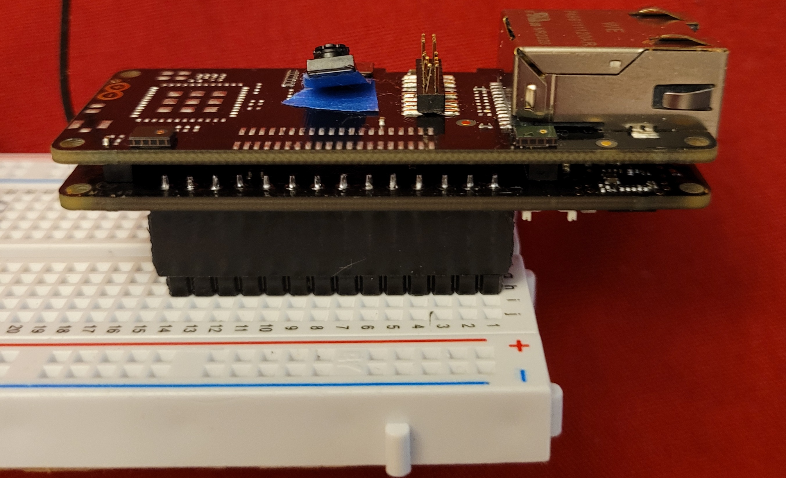

### Jeremy Ellis, Rocksetta

#### I simplify Robotics and Machine Learning

I am a technology teacher from BC, Canada.

## [Maker100](https://github.com/hpssjellis/maker100)
Presently working on improving my 7 year student tested Arduino Clone Robotics course [old course here](https://github.com/hpssjellis/particle.io-photon-high-school-robotics) to a new robotics and Machine Learning course called [maker100](https://github.com/hpssjellis/maker100) designed for any non-engineering University program and is planned to be ready for Jan 2022.

The course introduces all the hands on basics of robotics; sensors and actuators, with a simplified [Edge Impulse](https://www.edgeimpulse.com/) Machine Learning introduction all based around the (in my opinion) best all round microcontroller the new Arduino Pro boards: ~$100 USD [PortentaH7](https://store.arduino.cc/usa/portenta-h7) the easy to program dual core 160 pin cybertruck of an Arduino, ~$50 USD Portenta Vision shields ([Ethernet](https://store.arduino.cc/usa/portenta-vision-shield) and [LoRaWan](https://store.arduino.cc/usa/portenta-vision-shield-lora)), ~$50 USD [Portenta Breakout Board](https://store.arduino.cc/usa/portenta-breakout). The course uses my ever-changing offical Arduino IDE Library of examples [portenta-pro-community-solutions](https://github.com/hpssjellis/portenta-pro-community-solutions)

### Showing the Dual Core, 160 Pin, PortentaH7 on a breadboard upside down so the snap on Ethernet Vision Shield, Camera and Microphones are facing up, but still with easy access to the SD card and control button, visible is the Wifi and BLE antenae.
Needs extra male and female headers to do this.

## [Maker101](https://github.com/hpssjellis/maker101)

In researching the above Robotics Machine Learning Maker 100 program, I designed a simplified way to use TensorflowJS and TensorflowLite/micro with the Arduino boards. It is too complex for my High School students but would work well for a web based Javascript and Arduino C++ introduction to GoogleAI

**I would be willing to work over the duration of a few years with a University Professor on a paid [Google](https://blog.tensorflow.org/2021/06/2021-request-for-proposals-ml-faculty-awards.html?m=1) or other program to develop a TensorflowJS and TensorFlowMicro course as a University introduction to TinyML, Tensorflow and Machine Learning.** Using my working code, adapted with the Professors ideas and theory. Potentially my hands on videos, with the Professors theory videos. 

My TensorflowJS site is [www.rocksetta.com/tensorflowjs](https://www.rocksetta.com/tensorflowjs/) Note: everything is Vanilla Javascript as easy as possible. Examples are clear, Keras based and simple for students to build from.

My best, easiest TensorflowJS Vanilla Javascript example is this [xOr example](https://www.rocksetta.com/tensorflowjs/beginner-keras/20keras-xOr.html)

My TinyML Portenta examples site is [here](https://github.com/hpssjellis/my-examples-for-the-arduino-portentaH7/tree/master/m09-Tensoflow) although an easier example is on the above library.

## About Me

Name: Jeremy Ellis

Pronouns: he/him

Education: B. Sc. Chemistry 1986, B. vEd Swecondary School and a Diploma Counseling.  

Teaching: Have taught High School Math, General Science and Physics 11/12  

Now Teaching Coding (Game Development), Animation, Robotics and 3D Printing. All self developed courses.

Passionate about Open Source and the general public having hands on experience with both Robotics and Machine Learning.

I also teach a STEM class after school Thursdays at [GearBots.org](https://www.gearbots.org/)

Looking into how I can support capable Indigenous students to have access to Machine Learning

## Social Media

Website:  https://rocksetta.com/

Github: This page!  https://github.com/hpssjellis

Twitter: [Rocksetta on Twitter](https://twitter.com/rocksetta?lang=en)
 

or

 

Instagram: [jerteach on Instagram]()
 

TikTok (new)   [Rocksetta on TikTok](https://vm.tiktok.com/ZMdcCYcrD/)
 
  
or 
  
 

## Favorite Repositories

my Gitpod of EdgeImpulse   https://github.com/hpssjellis/my-gitpod-of-edge-impulse

This page   https://github.com/hpssjellis/hpssjellis

Arduino Portenta  https://github.com/hpssjellis/my-examples-for-the-arduino-portentaH7

Maker100  https://github.com/hpssjellis/maker100

My Portenta Arduino Library https://github.com/hpssjellis/portenta-pro-community-solutions

Particle Robotics course  https://github.com/hpssjellis/particle.io-photon-high-school-robotics

My Maker Videos  https://github.com/hpssjellis/my-examples-of-my-best-maker-videos

Fancvy ways to do javascript  https://github.com/hpssjellis/js-examples

MSS Machine Learning Club  https://github.com/hpssjellis/mss-machine-learning-club  or https://github.com/hpssjellis/fraser-valley-IDS-robotics-machine-learning-javascript-high-school

LoRa on the Portneta (advanced)  https://github.com/hpssjellis/portenta-lora-murata-stm32lo

Particle websocket hacking  https://github.com/hpssjellis/Particle-Spark-Core-Photon-Websocket-Hack

Arduino websocket  https://github.com/hpssjellis/arduino-simple-websocket

Bunch of STL 3D Printing files since I am too lazy to put things on Thingiverse.com   https://github.com/hpssjellis/my-3D-printing-stl

Messing with browser web-BLE  https://github.com/hpssjellis/my-3D-printing-stl only good on windows not Mac

Openthread as a gitpod  https://github.com/hpssjellis/my-gitpod-of-openthread

I messed with Quantum computing for a few months   https://github.com/hpssjellis/my-examples-for-quantum-computing

TensorflowJS to Arduino c header files  https://github.com/hpssjellis/Gitpod-auto-tensorflowJS-to-arduinon  or  https://github.com/hpssjellis/gitpod-tensorflowjs-to-arduino

Cartoon yourself (load the gitpage)  https://github.com/hpssjellis/zoom-cartoon-svg

Something I made witgh tensorflowjs   https://github.com/hpssjellis/beginner-tensorflowjs-examples-in-javascript

Wolfram try the gitpage  https://github.com/hpssjellis/wolfram-notebook-embedder

Virus estimator  try the gitpage https://github.com/hpssjellis/personal-virus-estimator

vscode javascript  https://github.com/hpssjellis/javascript-with-vscode-intellisense-no-ES6-no-Typescript

Nordic NRF52840 https://github.com/hpssjellis/everything-nrf52840-usb-dongles

??? https://github.com/hpssjellis/char-rnn-tensorflow-music-3dprinting

3D Animation  https://github.com/hpssjellis/3D-Animation

Nano 33 IOT guide  https://github.com/hpssjellis/Arduino-Nano-33-IoT-Ultimate-Guide

GITPOD  HTML from github   https://hpssjellis.github.io/rocksetta-gitpod-links/

Particle IOTA https://hpssjellis.github.io/rocksetta-gitpod-links/

TensorflowJS Pecha Kucha ligthening talks  see the gipage   https://github.com/hpssjellis/lightening-talk-Pecha-Kucha-tensorflowjs 

ParticlePhoton cloud9  https://github.com/hpssjellis/particle-photon-on-cloud9

Cordova Phoengap   https://github.com/hpssjellis/my-gitpod-cordova  or https://github.com/hpssjellis/my-gitpod-ionic-cordova

Tensorflwojs  speech  https://github.com/hpssjellis/tfjs-models-purejs-speech-commands

tensorflowjs BVH  animation   https://github.com/hpssjellis/tensorflowjs-bvh

Celebrity TensorflowJS  see gitpage  https://github.com/hpssjellis/celeb2-classify  gitpage at https://hpssjellis.github.io/celeb2-classify/

tensorflowjs faceapi see gitpage  https://github.com/hpssjellis/face-api.js-for-beginners-more-accurate

Particle photon raspberry pi   https://github.com/hpssjellis/particle-photon-raspberry-pi-iot

Teachable machine  https://github.com/hpssjellis/teachable-machine

tensorflowjs playground  https://github.com/hpssjellis/playground

ASH on windows  https://github.com/hpssjellis/my-installs-for-bash-on-windows

## Favorite Videos/Playlists

#### My Youtube list of Playlists

https://www.youtube.com/c/Rocksetta/playlists

#### Edge Impulse

https://www.youtube.com/playlist?list=PL57Dnr1H_egsQPnEObWHPhK1Q4g_IDWcR

#### Arduino Portenta H7 playlist by Rocksetta

https://www.youtube.com/playlist?list=PL57Dnr1H_egtm0pi-okmG0iE_X5dROaLw

####  Particle High School Robotics
https://www.youtube.com/playlist?list=PL57Dnr1H_egsL0r4RXPA4PY2yZhOJk5Nr

#### My TensorflowJS Videos
https://www.youtube.com/watch?v=dnDb-RAvxHg&list=PL57Dnr1H_egukaDgFqwEnDVStd7Jktg1E

## Other 

I get migraines but am wading through the Snake Oil and will eventually be able to reduce it from about 1 every 3 weeks, to a much lower number. Getting used to multiple migraines the first week of school. My migraine repositiroy is [pre-migraine](https://github.com/hpssjellis/pre-migraine)

Both my arms dislocate, but I find that the less I play: rugby, kayak, rockclimb, volleyball, pillow fight the less it is a problem.

###### By Jeremy Ellis. Use at your own risk!

<!--
**hpssjellis/hpssjellis** is a ✨ _special_ ✨ repository because its `README.md` (this file) appears on your GitHub profile.

Here are some ideas to get you started:

- 🔭 I’m currently working on ...  Hi there 👋
- 🌱 I’m currently learning ...
- 👯 I’m looking to collaborate on ...
- 🤔 I’m looking for help with ...
- 💬 Ask me about ...
- 📫 How to reach me: ...
- 😄 Pronouns: ...
- ⚡ Fun fact: ...
-->
  
  
  
  </body>
